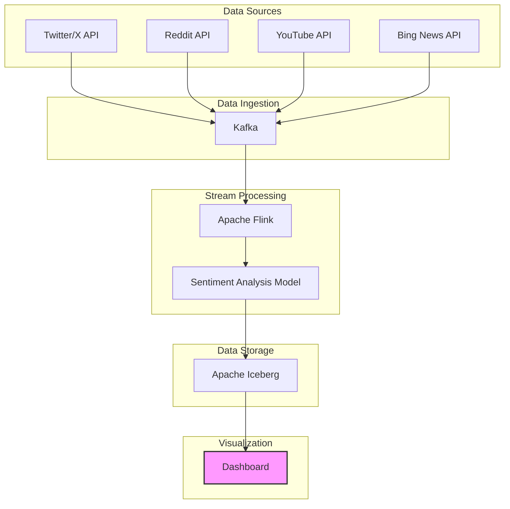

# Pulse
Real-time Dashboard which crawls data from Reddit, YouTube, Bing News API, and X (Twitter) to analyze sentiment for Samsung products.

## Architecture Overview



## Tech Stack

- **Data Collection**:
  - Twitter/X API
  - Reddit API
  - YouTube API
  - Bing News API

- **Data Streaming & Processing**:
  - Apache Kafka: Message broker for handling real-time data streams
  - Apache Flink: Stream processing framework

- **Sentiment Analysis**:
  - Natural Language Processing (NLP) models (BERT/RoBERTa)
  - Hugging Face Transformers

- **Data Storage**:
  - Apache Iceberg: Table format for large datasets with time-travel capabilities

- **Visualization**:
  - Superset or Grafana for dashboard creation
  - D3.js for custom visualizations

## Project Structure

```
pulse/
├── .github/                      # GitHub workflows and templates
├── config/                       # Configuration files
├── data_collectors/              # Data collection modules
│   ├── twitter_collector/        # Twitter/X API integration
│   ├── reddit_collector/         # Reddit API integration
│   ├── youtube_collector/        # YouTube API integration
│   └── bing_collector/           # Bing News API integration
├── data_processing/              # Stream processing modules
│   ├── kafka/                    # Kafka producers and consumers
│   ├── flink/                    # Flink jobs and transformations
│   └── sentiment/                # Sentiment analysis models
├── data_storage/                 # Data storage modules
│   └── iceberg/                  # Iceberg table configurations
├── dashboard/                    # Dashboard frontend
│   ├── components/               # UI components
│   ├── pages/                    # Dashboard pages
│   └── public/                   # Static assets
├── tests/                        # Test suites
├── docker/                       # Docker configurations
├── docs/                         # Documentation
└── scripts/                      # Utility scripts
```

## Implementation Steps

### 1. Data Collection Setup

- Configure API connections to Twitter/X, Reddit, YouTube, and Bing News
- Create data crawlers for each source with appropriate rate limiting
- Implement filtering by Samsung product keywords

### 2. Stream Processing Pipeline

- Set up Kafka topics for each data source
- Configure Kafka producers in data collectors
- Implement Flink jobs to consume from Kafka topics
- Create data transformation and enrichment processes

### 3. Sentiment Analysis Integration

- Implement real-time sentiment analysis using NLP models
- Score content on positive/negative/neutral scale
- Extract key phrases and topics

### 4. Data Storage with Apache Iceberg

- Configure Iceberg tables with appropriate schema
- Set up partitioning strategy (by time, source, product)
- Implement data writing from Flink to Iceberg

### 5. Dashboard Development

- Connect visualization tool to Iceberg tables
- Create real-time updating visualizations:
  - Sentiment trends over time
  - Source comparison charts
  - Keyword frequency analysis
  - Geographic distribution (where available)

## Dashboard Features


## Getting Started

1. Clone the repository
2. Set up API keys in `config/api_keys.yaml`
3. Run `docker-compose up` to start the infrastructure
4. Access the dashboard at `http://localhost:3000`

## Contributing

Please read [CONTRIBUTING.md](CONTRIBUTING.md) for details on our code of conduct and the process for submitting pull requests.

## License

This project is licensed under the MIT License - see the [LICENSE](LICENSE) file for details.
